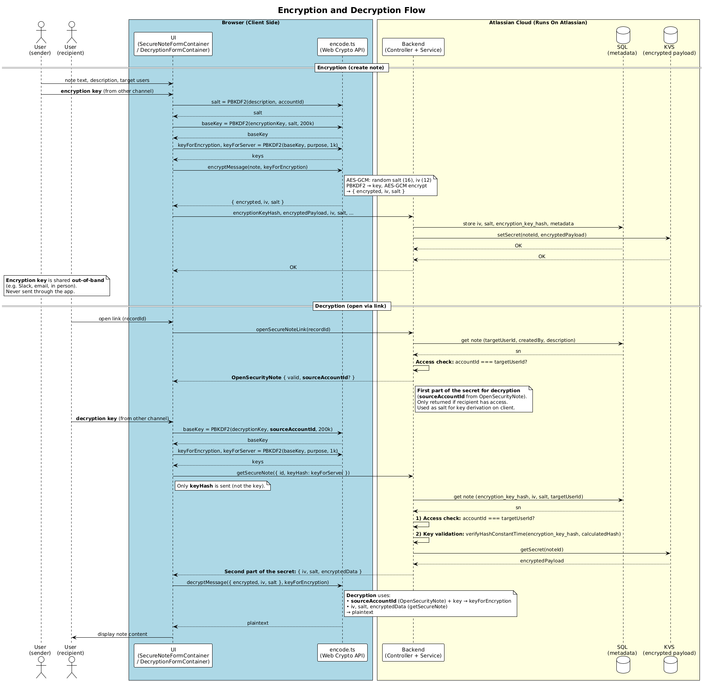

# Forge-Secure-Notes-for-Jira

[](https://github.com/vzakharchenko/Forge-Secure-Notes-for-Jira/actions/workflows/node.js.yml)
[](https://snyk.io/test/github/vzakharchenko/Forge-Secure-Notes-for-Jira)
[](https://deepscan.io/dashboard#view=project&tid=26652&pid=30673&bid=987394)
[](https://coveralls.io/github/vzakharchenko/Forge-Secure-Notes-for-Jira)

[](https://sonarcloud.io/summary/new_code?id=vzakharchenko_Forge-Secure-Notes-for-Jira)
[](https://sonarcloud.io/summary/new_code?id=vzakharchenko_Forge-Secure-Notes-for-Jira)
[](https://sonarcloud.io/summary/new_code?id=vzakharchenko_Forge-Secure-Notes-for-Jira)


Share sensitive information securely within Jira issues. Create one-time, expiring encrypted notes with out-of-band key exchange. Built with Atlassian Forge, Custom UI &amp; @forge/sql, @forge/kvs.

## Hackathon Project

This project was submitted to **Codegeist 2025: Atlassian Williams Racing Edition** hackathon on Devpost.

🔗 **[View on Devpost](https://devpost.com/software/secure-notes-for-jira-coegvb)**

## 🧠 About the Project

### Inspiration

"Secure Notes for Jira" was inspired by a common challenge faced by many teams: the need to share sensitive information — such as access credentials, API keys, private feedback, or temporary passwords — directly within a Jira issue, without exposing it in issue fields, comments, or descriptions.

While Jira excels at task tracking and collaboration, it lacks a secure, ephemeral channel for confidential communication. This app bridges that gap by providing a secure mechanism for sharing notes that are:

- Confidential
- Time-limited
- Verifiably read by the intended recipient
- Automatically deleted after viewing

### 🔒 Security Features

- 🔐 Create encrypted notes on Jira issues
- 🕒 Choose an expiration: 1 hour, 1 day, 7 days, 10 days
- 🔑 Generate a one-time decryption key (created by user, never stored on backend - only the sender and recipient know the key)
  - The sender copies the key or sends it via email at creation time; **sessionStorage** is used only if the sender forgot to copy the key — to retrieve it later from the same browser (copying is detected by clicking the key field or the copy button)
- 📥 View received notes (with key)
- 📤 View and delete sent notes — sender can copy the key again or send it via email (from the same browser if the key was stored in sessionStorage when they forgot to copy it)
- 🧨 Note self-destructs after reading or upon expiry
- ⏳ Expiration is enforced automatically using a Forge `scheduledTrigger`
- 👤 **Only the authorized recipient can decrypt** — neither sender nor administrators can read the note content
- 📧 **Email key sharing** — send decryption key to recipient via email (Gmail/mailto) while maintaining Zero Trust architecture
  - ⚠️ **Never share keys through Jira** — use separate channels (Slack, email, phone) to maintain Zero Trust
- 📧 **Email Notifications**: Automatic email notifications are sent:
  - When a secure note is created and shared with you
  - When a secure note expires and is automatically deleted
  - When a secure note is manually deleted by the creator

### 🖥 UI Features

- 📎 Open decryption links directly from the Issue Panel or via email
- 🧭 Support for routing and deep-linking to global pages
- ⏱️ 5-minute countdown timer during note viewing
- 🌓 Full dark/light mode support based on Jira theme
- 👥 Multiple recipients support - send secure notes to multiple users at once
- 📝 Description field for better note organization and tracking
- 📊 Comprehensive audit pages with detailed history tracking:
  - **My History**: View your personal secure notes history with pagination (accessible from global page)
  - **My Issue History**: Browse notes by issue with detailed audit trails (accessible from global page)
  - **My Project History**: View notes organized by project (accessible from global page)
  - **User History**: Admin-only view of all users' secure notes (accessible from admin page)
- 📈 Expandable status history showing CREATED, VIEWED, DELETED, and EXPIRED events
- 📥 CSV Export functionality on all audit pages for data analysis
- 🔄 Real-time updates using @forge/realtime for instant UI synchronization
- 📋 Modern table UI using Atlassian Design System components
- 🤖 **Rovo AI Agent** - Natural language analytics for Security Notes data with "Ask Rovo" button in audit pages for quick access

## 🛠 Technical Implementation

### Architecture

The project follows a clean architecture pattern with clear separation of concerns:

- **Frontend:** React + Vite (Forge Custom UI)
- **Backend:** Forge Functions using `@forge/api`, `@forge/sql`, `@forge/kvs`
- **ORM:** [forge-sql-orm](https://github.com/vzakharchenko/forge-sql-orm)
- **AI Analytics:** Atlassian Rovo AI agent for natural language queries
- **Storage:**
  - Encrypted content in `@forge/kvs` (via `setSecret`)
  - Metadata in `@forge/sql`

### Jira Service Management Portal Integration

The application seamlessly integrates with Jira Service Management portals through automatic context detection and transformation:

- **Context Detection**: The `ContextService` automatically detects portal context by checking for `extension.portal` and `extension.request.key` properties
- **Request Resolution**: When in portal context, the app uses `JiraUserService.getIssueByPortalKey()` to fetch customer request details via the Service Desk API (`/rest/servicedeskapi/request/{key}`)
- **Context Transformation**: Portal requests are automatically transformed into issue context, ensuring all secure note functionality works identically:
  - Portal request keys are mapped to underlying Jira issue keys
  - Customer request metadata is preserved in the context
  - Issue and project information is extracted from the customer request
- **Frontend Integration**: The React frontend (`ForgeModule.tsx`) detects portal context and fetches customer request information when needed
- **Seamless Experience**: Users (both portal customers and Jira users) experience the same secure notes functionality regardless of whether they're in a standard Jira issue or a JSM portal request

### Forge Permissions & Scopes

The application requires specific Forge scopes to function properly. Each scope is essential for core functionality:

#### Required Scopes:

- **`read:jira-user`**:
  - **Purpose**: Read information about the current authenticated user
  - **Usage**: Used by `JiraUserService.getCurrentUser()` to fetch the current user's profile, display name, and avatar URLs
  - **Required for**: Displaying user information when creating secure notes, showing creator details in note cards

- **`read:user:jira`**:
  - **Purpose**: Read information about other Jira users by their account ID
  - **Usage**: Used by `JiraUserService.getUserById()` to fetch recipient user details (display name, avatar) when creating secure notes
  - **Required for**: Populating recipient information in secure note creation, showing user avatars and names in the UI

- **`read:email-address:jira`**:
  - **Purpose**: Read email addresses of Jira users
  - **Usage**: Used by `JiraUserService.getUserEmail()` to fetch creator and recipient email addresses (e.g. for audit metadata and email key sharing)
  - **Required for**: Storing created/target email in security note metadata, pre-filling recipient email when sending the decryption key via email
  - **Zero Trust**: Read-only scope (no ingress). The decryption key is **never** transmitted through the app or Atlassian infrastructure — email is composed client-side and sent via the user's email client. The app only reads email addresses for metadata and UI convenience; Zero Trust architecture is not violated.

- **`read:permission:jira`**:
  - **Purpose**: Check user permissions in Jira
  - **Usage**: Used by `JiraUserService.isJiraAdmin()` and `getMyPermissions()` to determine if a user has admin privileges
  - **Required for**:
    - Admin-only features (User History audit page)
    - Row-level security in Rovo AI queries (admin users see all notes, non-admin users see only their own)
    - Access control for audit pages

- **`send:notification:jira`**:
  - **Purpose**: Send email notifications to Jira users
  - **Usage**: Used by notification functions (`sendIssueNotification`, `sendExpirationNotification`, `sendNoteDeletedNotification`) to send email alerts
  - **Required for**:
    - Notifying recipients when a secure note is created
    - Alerting users when a secure note expires
    - Notifying users when a secure note is deleted

- **`storage:app`**:
  - **Purpose**: Access Forge Key-Value Storage (KVS) for the app
  - **Usage**: Used by `SecurityStorage` to store encrypted note content via `@forge/kvs.setSecret()`
  - **Required for**:
    - Storing encrypted secure note payloads
    - Temporary storage of sensitive data before decryption
    - Secure data persistence (encrypted content is stored separately from metadata)

- **`read:app-global-channel:realtime`**:
  - **Purpose**: Read from global real-time channels for instance communication
  - **Usage**: Used by `@forge/realtime.publishGlobal()` to broadcast events when notes are created, viewed, or deleted
  - **Required for**:
    - Real-time UI updates across all users viewing the same issue
    - Instant synchronization when notes are created or deleted
    - Live status updates without page refresh

- **`read:request:jira-service-management`**:
  - **Purpose**: Read customer request information from Jira Service Management portals
  - **Usage**: Used by `JiraUserService.getIssueByPortalKey()` to fetch customer request details via Service Desk API
  - **Required for**:
    - JSM portal support - fetching request details from portal context
    - Mapping portal request keys to underlying Jira issue keys
    - Displaying secure notes in Jira Service Management customer portals

> **Note**: All scopes are read-only except `send:notification:jira` and `storage:app`, which are necessary for core functionality. The app follows the principle of least privilege - it only requests the minimum permissions required to function.

### Security Design

The diagram below shows the end-to-end flow: creating a note (key and encryption on the client; backend stores only the key hash and encrypted payload) and opening a note (backend returns metadata and ciphertext after access check; decryption on the client using the key shared out-of-band).



- **Client-side encryption** using Web Crypto API
- **AES-GCM** with 32-byte key derived via PBKDF2
- **Encryption key security:**
  - The encryption key is **generated by the user** and **never stored on the backend**
  - Only the user who creates the key knows it
  - Backend stores only `encryption_key_hash` (hash of the key) for validation purposes
  - The actual encryption key is required for decryption and must be shared out-of-band
  - **Sender key storage (fallback)**: The encryption key is stored in the sender's browser `sessionStorage` (encrypted) **only as a fallback** — when the sender forgot to copy the key at creation time (copying is detected by clicking the key field or the copy button), they can retrieve and copy it later from the same browser
    - ⚠️ **Important**: This is **local browser storage only** — if the storage is cleared, or if the issue is opened in a different browser or on a different machine, this capability will not be available
    - The key is encrypted before being stored in `sessionStorage` using a hash derived from the note description and sender's account ID
- **Split data model for decryption:**
  - Half of the decryption data is with the user: **encryption key** (known only to the user)
  - Other half is in metadata: **IV** (Initialization Vector) and **salt** stored in `@forge/sql`
  - Both parts are required to decrypt the content
- **Double protection: Key + Authorization**
  - **Who can and cannot decrypt**: Only the authenticated recipient (the user designated as `targetUserId`) with the correct decryption key can read the content. The **sender**, **Jira Admin**, and **Atlassian Cloud developer** cannot decrypt the note.
  - **Authorization**: Forge authenticates the user and guarantees that `accountId` belongs to that user. The backend returns decryption data only when `accountId === targetUserId`.
  - **Key bound to the recipient's account**: The backend stores a hash of the key derived with PBKDF2 using the recipient's `accountId` as salt. The same key yields a different hash per recipient. The backend returns the encrypted payload only when the supplied key hash matches the stored one for that recipient.
  - **Key + encrypted data both required**: Decryption needs the key (shared out-of-band) and the encrypted content (IV, salt, ciphertext) from `@forge/kvs`. The backend returns the encrypted payload only after authorization and key-hash verification. The key is never sent to or stored on Atlassian servers; only the hash and the encrypted blob are stored.
  - **Purpose of the key**: Atlassian Cloud does not have the decryption key. Without it, the stored data cannot be decrypted.

  **Implementation example:**

  ```typescript
  // src/services/SecurityNoteService.ts
  async getSecuredData(securityNoteId: string, key: string) {
    const accountId = getAppContext()!.accountId;  // ← Authorization via Forge
    const sn = await this.securityNoteRepository.getSecurityNode(securityNoteId);
    if (accountId !== sn?.targetUserId) {  // ← Check: only recipient can decrypt
      return undefined;
    }
    const calculatedHash = await calculateSaltHash(key, sn.targetUserId);  // ← Key + accountId
    verifyHashConstantTime(sn.encryptionKeyHash, calculatedHash, errorMessage);
    // ...
  }
  ```

- Random IV generation for each message
- Encrypted content stored in `@forge/kvs.setSecret`
- Metadata (IV, salt, encryption_key_hash) stored in `@forge/sql`
- Out-of-band key exchange required (key must be shared separately via secure channel)
  - **WARNING**: If you share the decryption key through issues, comments, or descriptions in Jira/Atlassian Cloud, you violate Zero Trust architecture (Atlassian would then have everything needed to recover the secret).
  - **Correct approach**: Share the key through separate, independent channels such as Slack, Teams, direct email (not through Jira), phone call, or other secure communication methods outside of Atlassian infrastructure.
- **Email key sharing**: The app provides functionality to send the decryption key to the recipient via email (Gmail compose or mailto link)
  - ⚠️ **Important**: Always verify the recipient's email address before sending — the app cannot verify email addresses automatically
  - This feature maintains Zero Trust architecture and "Runs on Atlassian" badge compliance — the email is composed entirely client-side in your browser and sent directly through your email client (Gmail, Outlook, etc.)
  - **No backend involvement**: The email does **not** pass through the app's backend, Atlassian Cloud, or Jira infrastructure — it goes directly from your browser to your email provider
  - The decryption key is never transmitted to or stored on Atlassian servers — it only exists in the email composed in your browser and sent through your email client
- Automatic content deletion after viewing

### 🔒 Logging & Privacy

**Application Logging:**

The application generates logs for debugging and monitoring purposes. These logs may contain technical information such as:

- Function execution status
- API call results
- Error messages
- Performance metrics

**Privacy & Developer Access:**

- **Logs are stored on Atlassian Forge infrastructure** and are accessible to the application developer for troubleshooting purposes
- **You can disable logging** if you prefer that the developer does not have access to application logs
- **Logs do not contain sensitive data** such as:
  - Encryption keys or decrypted note content (these are never transmitted to the backend)
- **Only technical information** is logged: function execution status, API call results, error messages (without sensitive data), and performance metrics

**If You Encounter Issues:**

If you experience problems with the application, we may need access to logs to diagnose the issue. Here's how you can help:

1. **Download Application Logs:**
   - Logs can be accessed through your Atlassian instance's Forge app management interface
   - Export the relevant log entries for the time period when the issue occurred

2. **Review Logs Before Sharing:**
   - Logs have been sanitized and do not contain Account IDs or Note IDs
   - However, please review the logs to ensure no other sensitive information is included
   - Remove or redact any data you consider confidential before sharing

3. **Submit Logs:**
   - **Via JSM Request:** Create a support request in our Jira Service Management portal and attach the logs
   - **Via GitHub Issue:** Open an issue in the [GitHub repository](https://github.com/vzakharchenko/Forge-Secure-Notes-for-Jira/issues) and attach the logs
   - Choose whichever method is more convenient for you

**Important Notes:**

- Logs help us identify and fix bugs more quickly
- We respect your privacy and only use logs for troubleshooting purposes
- **Logs are automatically sanitized** - Account IDs and Note IDs have been removed from all log messages
- If you prefer not to share logs, you can describe the issue in detail instead

## 🚀 Getting Started

### Prerequisites

- Node.js (v22 or higher)
- npm
- Atlassian Forge CLI (`forge` command-line tool)
- A Jira Cloud instance with admin access
- Forge development environment set up

### Installation

1. Clone the repository:

```bash
git clone https://github.com/your-username/Forge-Secure-Notes-for-Jira.git
cd Forge-Secure-Notes-for-Jira
```

2. Install dependencies:

```bash
npm install
```

3. Register your Forge app:

```bash
forge register
```

4. Build UI:

```bash
cd static
npm install
npm run build
cd ..
```

5. Deploy to production:

```bash
forge deploy -e production
```

6. Install in your Jira instance:

```bash
forge install -e production
```

### Development

1. Deploy the app:

```bash
forge deploy
```

2. Install in your Jira instance:

```bash
forge install
```

3. Start the development server:

```bash
forge tunnel
```

## 📝 Usage Guide

### Jira Service Management Portal Support

**Secure Notes for Jira** fully supports **Jira Service Management (JSM) portals**, allowing customers and agents to create and manage secure notes directly within customer request views.

#### Key Features for JSM Portals:

- ✅ **Automatic Portal Detection**: The app automatically detects when it's running in a JSM portal context and adapts accordingly
- ✅ **Customer Request Integration**: Secure notes are seamlessly integrated with JSM customer requests
- ✅ **Portal User Support**: Both portal customers and Jira users can create and view secure notes
- ✅ **Request Type Awareness**: The app recognizes JSM request types and displays the secure notes panel appropriately
- ✅ **Seamless Experience**: The same secure note functionality available in standard Jira issues works identically in JSM portals

#### How It Works:

1. **In JSM Portal Context**: When viewing a customer request in a JSM portal, the "Secure Notes For Jira" app appears in the Apps section
2. **Secure Notes Panel**: The dedicated "Secure notes panel" is displayed below the request details
3. **Create Notes**: Portal users can create secure notes just like in standard Jira issues
4. **View Notes**: Both incoming and sent notes are displayed with the same UI and functionality
5. **Automatic Context Handling**: The app automatically:
   - Detects portal context via `extension.portal` and `extension.request.key`
   - Fetches customer request details using the Service Desk API
   - Transforms portal context to issue context for seamless operation
   - Handles both portal customers and Jira users transparently

#### Portal-Specific Behavior:

- **For Portal Customers**: When a customer (reporter) views their request, they can see and interact with secure notes
- **For Agents**: Jira users (agents) viewing the same request have full access to secure notes functionality
- **Request Key Mapping**: Portal request keys (e.g., `SN-8`) are automatically mapped to underlying Jira issue keys
- **Context Transformation**: Portal requests are automatically converted to issue context, ensuring all secure note features work seamlessly

#### Example Use Cases:

- **Customer Support**: Agents can share sensitive information (like temporary passwords or access codes) securely with customers through portal requests
- **Internal Communication**: Team members can exchange confidential information related to customer requests
- **Secure Documentation**: Store sensitive details about customer requests that shouldn't be visible in public comments

> **Note**: The app maintains the same security guarantees in portal contexts as in standard Jira issues. All encryption, expiration, and access control features work identically.

### Creating a Secure Note

1. Open any Jira issue or JSM customer request
2. Click on the "Secure Notes" panel
3. Click "Create New Secure Note"
4. Fill in the required fields:
   - **Select recipients**: Choose one or multiple users who can decrypt the note
   - **Description**: Enter a description of what you're sharing (required)
   - **Your Secure Note**: Enter the secret message content (max 10KB recommended)
   - **Set Note Expiry**: Choose expiration time (1 hour, 1 day, 7 days, 10 days, or custom date)
5. Click "Generate New Key" to create an encryption key
6. **Key Storage (fallback)**: If you forget to copy the key at creation time (copying is detected by clicking the key field or the copy button), it is stored in your browser's `sessionStorage` (encrypted) so you can retrieve and copy it later from the same browser
   - ⚠️ **Important**: This is local browser storage only — if you clear storage or open the issue in a different browser/machine, you won't be able to retrieve the key from storage
   - Prefer copying the key (click the key field or copy button) or sending it via email right after creation; use the sent notes panel to copy the key again if it was stored in sessionStorage
   - 🔒 **Security Note**: The key stored in your browser is **useless by itself** — even if you (the sender) or anyone else has the key, it cannot decrypt the note without the **authorized recipient's account**. The key only works in combination with the recipient's authorization — only the designated recipient can use the key to decrypt the note
7. **Share the Key**: Copy the encryption key and share it securely with the recipient:
   - ⚠️ **CRITICAL SECURITY WARNING**: **DO NOT** share the key through Jira comments, issue descriptions, or any Atlassian Cloud channels. This would violate Zero Trust architecture because Atlassian Cloud would have all the data needed to decrypt the secret.
   - **Correct sharing methods**:
     - **Option 1**: Copy manually and share via Slack, Teams, phone call, or another secure channel **outside of Atlassian infrastructure**
     - **Option 2**: Use the "Send over Gmail" or "Send over email" button to compose an email with the key pre-filled
       - ⚠️ **Always verify the recipient's email address** before sending — the app cannot verify email addresses automatically
       - The email is composed entirely client-side in your browser and sent directly through your email client (Gmail, Outlook, etc.)
       - **No backend involvement**: The email does **not** pass through the app's backend, Atlassian Cloud, or Jira infrastructure — it goes directly from your browser to your email provider
       - This maintains Zero Trust architecture and "Runs on Atlassian" badge compliance
8. Click "Create & Encrypt Note"
9. **Email Notification**: The recipient(s) will automatically receive an email notification with:
   - A direct link to access the secure note
   - The expiration date and time
   - Instructions on how to obtain the decryption key (you must share it separately)
10. The note will be automatically updated in the panel in real-time using @forge/realtime

### Viewing a Secure Note

1. Open the secure note link (from email notification or issue panel)
2. Enter the decryption key (shared by the sender via secure channel **outside of Jira/Atlassian Cloud** — e.g., Slack, Teams, direct email, phone call)
   - ⚠️ **Important**: The key should **never** be shared through Jira comments, descriptions, or Atlassian Cloud channels, as this violates Zero Trust architecture
3. **Authorization Check**: The system verifies that you are the authorized recipient — only the designated recipient's account can decrypt the note
   - ⚠️ **Access Control**: Neither the sender nor administrators can decrypt the note — only the authorized recipient
   - If you're not the recipient, the decryption will fail even with the correct key
4. View the message content
5. Use "Copy and Close" to save the content and destroy the note
6. The note will be automatically destroyed after viewing or when expired

**Important Security Notes:**

- **Only the recipient can decrypt**: The encryption key is issued to the recipient, and authorization checks ensure only the authenticated recipient can access the note
- **Key safety**: If the key accidentally falls into wrong hands, it's not a security issue — the key alone is useless without the correct recipient's account authorization
- **Purpose**: The key ensures Atlassian Cloud cannot decrypt notes even if their infrastructure is compromised — they don't have sufficient information without the key

### Email Notifications

The application automatically sends email notifications for important events:

1. **When a Secure Note is Created**:
   - Recipients receive an email with subject "🔐 A security note has been shared with you"
   - The email includes a direct link to access the note
   - The expiration date and time are clearly displayed
   - Instructions on how to obtain the decryption key are provided

2. **When a Secure Note Expires**:
   - Recipients receive an email with subject "⚠️ A Secure Note has expired and was deleted"
   - The email notifies that the note has been automatically deleted
   - Instructions to contact the sender if access is still needed

3. **When a Secure Note is Deleted**:
   - Recipients receive an email with subject "🗑️ A Secure Note has been deleted"
   - The email notifies that the creator has manually deleted the note
   - Instructions to contact the sender if access is still needed

**Note**: Email notifications are sent via Jira's notification system and will appear in the recipient's email inbox associated with their Jira account.

### Audit and History Pages

The application provides comprehensive audit pages:

1. **My History** (`/myHistory` - accessible from global page):
   - View all your secure notes with pagination
   - See description, status, issue/project keys, and timestamps
   - Expand rows to view status history (CREATED, VIEWED, DELETED, EXPIRED)
   - Export all data to CSV format

2. **My Issue History** (`/myIssue` - accessible from global page):
   - Browse all issues that contain secure notes
   - Click on an issue to view detailed audit information
   - Export issue-specific data to CSV

3. **My Project History** (`/myProject` - accessible from global page):
   - View all projects with secure notes
   - Drill down into project-specific audit details
   - Export project data to CSV

4. **User History** (`/userHistory` - Admin only, accessible from admin page):
   - Administrators can view all users' secure notes
   - Select a user to see their complete history
   - Export user-specific audit data to CSV

All audit pages feature:

- Pagination (10 items per page)
- Expandable status history rows
- CSV export functionality
- Real-time data updates
- **"Ask Rovo" button**: Automatically opens the Rovo AI agent with a pre-configured prompt based on the current audit tab:
  - **My History**: Prepares an activity report for the current user, including notes created by them and shared with them
  - **My Issue History**: Prepares an activity report for the selected issue
  - **My Project History**: Prepares an activity report for the selected project
  - **User History**: Prepares an activity report for the selected user

### Rovo AI Analytics

The application includes a **Rovo AI agent** that enables natural language queries about Security Notes data. Users can ask questions in plain English, and the agent will generate and execute SQL queries to provide insights.

> **📖 Technical Details**: A detailed description of how Rovo works with SQL, including the secure "Guide + Guard" pattern, query validation, row-level security, and safety mechanisms, is available in this [community article](https://community.developer.atlassian.com/t/rovo-forge-sql-a-secure-pattern-for-natural-language-analytics-in-forge-apps/97028).

**Features:**

- Ask questions like:
  - "Show all users which I shared security notes with"
  - "Show my notes from last week"
  - "Prepare a report of all descriptions and who shared notes last month"
  - "Show top 10 users who created the most security notes" (Admin only)
  - "Show all security notes created in the last 30 days"
  - "Display all notes shared with me that are still active"

**Security:**

- Only read-only SELECT queries are allowed
- Queries must target only the `security_notes` table (no JOINs, subqueries, or references to other tables)
- JOIN operations are automatically detected and blocked using EXPLAIN query plan analysis
- Window functions (e.g., `COUNT(*) OVER(...)`) are not allowed and are automatically detected and blocked
- Non-admin users can only see notes they created or received
- Admin users have full access to all notes
- Sensitive fields are protected:
  - **Encryption key**: Never stored on backend, only known to the user who created it
  - **encryption_key_hash**: Stored for validation only (cannot be used to decrypt)
  - **IV and salt**: Stored in metadata but useless without the encryption key
  - These fields are never exposed in Rovo queries or any API responses
- Row-level security is enforced automatically
- Security columns (`created_by`, `target_user_id`) must be selected as raw columns for proper access control

**How to use:**

1. **Quick access via Audit pages**: Click the "Ask Rovo" button on any audit page (My History, My Issue History, My Project History, or User History). The button automatically opens the Rovo AI agent with a pre-configured prompt based on the current tab context.
2. **Manual access**: Open the Rovo AI assistant in Jira directly (agent "Security Notes analytics")
3. Ask questions about Security Notes using natural language
4. The agent will generate SQL queries and return results
5. Results are explained in natural language with summaries and highlights

**Example queries:**

- "Can you show all users which I shared security notes with?"
- "Show all users which I shared security notes with."
- "Report security notes from last month."
- "Show me top 10 users who created the most security notes." (Admin only)
- "Display all security notes created in the last 30 days."
- "Show all notes shared with me that are still active."

## 🏗️ Development Architecture & Quality

### Component Structure

The codebase is organized into separate components (folders) for better maintainability and clear boundaries:

- **`src/resolvers/`** - API resolvers (handlers for Forge functions)
- **`src/services/`** - Business logic services
- **`src/database/`** - Database repositories and entities
- **`src/controllers/`** - Request controllers that coordinate services
- **`src/storage/`** - Storage abstractions (KVS operations)
- **`shared/`** - Shared contracts between frontend and backend

This separation allows for:

- Clear dependency boundaries
- Easier testing and mocking
- Better code organization
- Explicit visibility of dependencies between components

### Frontend-Backend Contract

The project uses a **shared module** (`shared/`) to define the contract between frontend and backend:

- **Resolver Names** in `shared/ResolverNames.ts` - **Centralized definition of all resolver function names**. This is the single source of truth for resolver names used by both frontend and backend. All resolver names must be defined here to ensure consistency.
- **DTOs (Data Transfer Objects)** in `shared/dto/` - Define request/response structures
- **Response Types** in `shared/responses/` - Type-safe response interfaces
- **Type Definitions** in `shared/Types.ts` - Common type definitions

**Important:** The contract uses **runtime validation** with `class-validator` because TypeScript types are erased at runtime. This means:

- All DTOs are validated using `class-validator` decorators
- Invalid requests are rejected before reaching business logic
- Type safety in TypeScript is not enough - runtime validation is essential
- This is different from languages like Java where types exist at runtime

**Resolver Names:**
All resolver function names are defined in `shared/ResolverNames.ts` as an enum. This ensures that:

- Frontend and backend use the same resolver names
- Typos and inconsistencies are prevented
- Refactoring is easier (change in one place)
- Type safety is maintained across the codebase

Example:

```typescript
// shared/ResolverNames.ts
export enum ResolverNames {
  GET_MY_SECURED_NOTES = "getMySecuredNotes",
  CREATE_SECURITY_NOTE = "createSecurityNote",
  // ... all resolver names defined here
}

// Usage in controller
functionName(): string {
  return ResolverNames.CREATE_SECURITY_NOTE;
}

// Usage in frontend
invoke(ResolverNames.CREATE_SECURITY_NOTE, payload);
```

**DTO Validation Example:**

```typescript
// shared/dto/NewSecurityNote.ts
export class NewSecurityNote {
  @IsString()
  @IsNotEmpty()
  description!: string;

  @IsString()
  @IsNotEmpty()
  encryptedData!: string;
  // ... validation ensures data integrity at runtime
}
```

### Dependency Injection (DI)

The project uses **[Inversify](https://github.com/inversify/InversifyJS)** for dependency injection, which provides several key benefits:

- **Code Separation:** DI allows clear separation of concerns and makes dependencies explicit
- **Modular Dependency Management:** Each resolver group and trigger can have its own dependency container, making it easy to see exactly which services are used in each module
- **Explicit Dependencies:** You can clearly see where specific services are used (e.g., `@src/storage/SecurityStorage.ts`) by examining the DI container setup
- **Security Boundaries:** Admin-only services can be restricted to admin modules in the manifest, preventing them from being accidentally used in non-admin resolvers
- **Testability:** Services can be easily mocked and replaced for testing

**Structure:**

- Each resolver group (`src/resolvers/global/`, `src/resolvers/issue/`) has its own `di.ts` file that sets up the dependency container
- Services are registered with injection tokens defined in `src/constants/ForgeInjectionTokens.ts`
- Controllers and services use `@injectable()` decorator and `@inject()` for dependency injection

**Example:**

```typescript
// src/resolvers/global/di.ts
export const setupContainer = (): Container => {
  const container = new Container();
  container.bind(FORGE_INJECTION_TOKENS.SecurityNoteService).to(SecurityNoteService);
  container.bind(FORGE_INJECTION_TOKENS.SecurityStorage).to(SecurityStorage);
  // ... explicit dependency registration
};
```

### Code Quality Tools

The project uses several tools to maintain code quality and consistency:

#### ESLint (Linter)

**ESLint** is a static code analysis tool that identifies problematic patterns and potential bugs in JavaScript/TypeScript code. It's crucial for maintaining code quality and consistency across the project.

**Why it's important:**

- **Catches bugs early:** Identifies potential errors before they reach production
- **Enforces coding standards:** Ensures consistent code style across the team
- **Improves code maintainability:** Helps keep code readable and maintainable
- **Prevents common mistakes:** Flags anti-patterns and problematic code structures

**Usage:**

```bash
# Run linter
npm run lint

# Fix auto-fixable issues
npm run lint:fix
```

**CI Integration:** The linter is run in CI pipelines to ensure all code meets quality standards before merging. It's also recommended to run `npm run lint` locally before committing changes to catch issues early.

#### Prettier (Code Formatter)

**Prettier** is an opinionated code formatter that enforces consistent code formatting across the project. It automatically formats code according to predefined rules, eliminating debates about code style.

**Features:**

- **Automatic formatting:** Formats code on save or via command
- **Consistent style:** Ensures all code follows the same formatting rules
- **Integration with Git hooks:** Uses `lint-staged` and `husky` to automatically format code before commits
- **Improves readability:** Consistent formatting makes code easier to read and understand

**Usage:**

```bash
# Format all files
npm run format

# Check formatting without making changes
npm run format:check
```

**Git Hooks:** Prettier is integrated with `husky` and `lint-staged` to automatically format staged files before commits, ensuring all committed code is properly formatted.

#### Knip (Dependency Checker)

**Knip** is a tool that finds unused dependencies, files, and exports in your project. It's essential for maintaining a clean dependency tree and reducing security surface area.

**Why it's important:**

- **Reduces security risk:** Unused dependencies can contain vulnerabilities that Snyk will flag, even if you're not using them
- **Cleaner dependency tree:** Helps identify and remove dependencies that are no longer needed
- **Easier security maintenance:** When using Snyk for security scanning, it's much easier to maintain security if you only have dependencies you actually use
- **Smaller bundle size:** Removing unused dependencies reduces the final bundle size

**Usage:**

```bash
# Check for unused dependencies
npm run knip
```

**Snyk Integration:** When using Snyk for security vulnerability scanning, Knip helps ensure that Snyk only checks dependencies that are actually used in the codebase. This significantly simplifies security maintenance by avoiding false positives from unused packages.

## 🤝 Contributing

1. Fork the repository
2. Create your feature branch (`git checkout -b feature/amazing-feature`)
3. Commit your changes (`git commit -m 'Add some amazing feature'`)
4. Push to the branch (`git push origin feature/amazing-feature`)
5. Open a Pull Request

## 📄 License & Security

**Source Available / Fair Source**
This project is licensed under the Business Source License (BSL 1.1).

- **Open for Audit**: You can review the source code to verify our "Zero Egress" and encryption claims.
- **Free for Dev**: You can fork, study, and test the code freely.
- **Paid for Prod**: Production use requires a license via the Atlassian Marketplace.

Note: On 2030-01-01, this version of the code automatically becomes Open Source (MIT).

## 💬 Support

For support, please open an issue in the GitHub repository .
